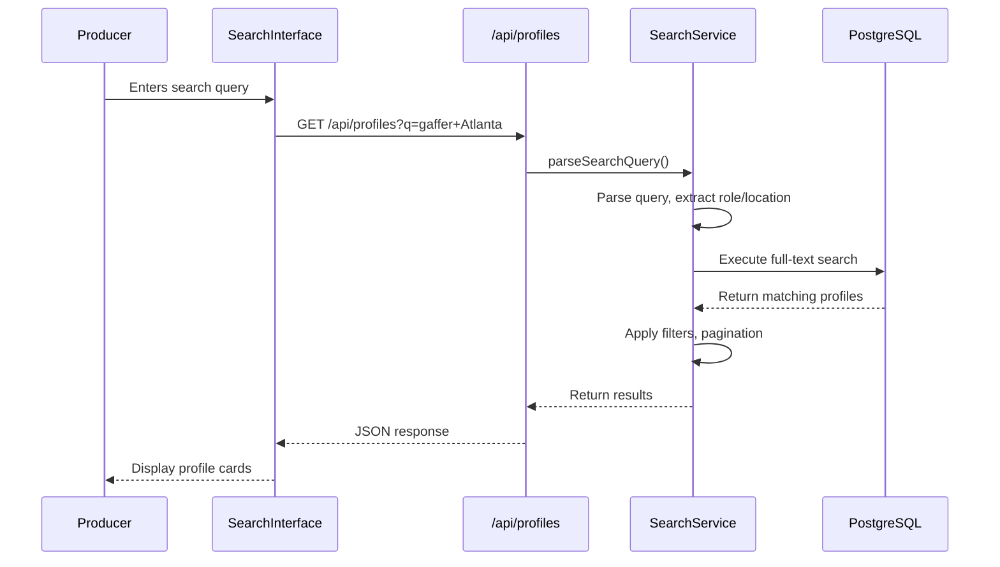
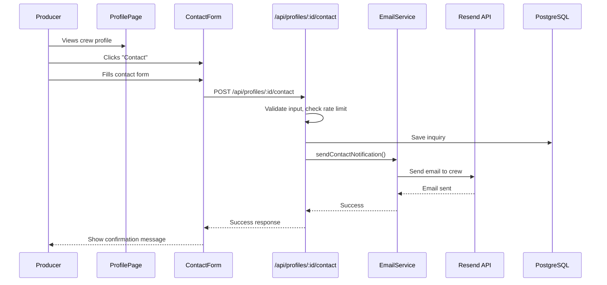
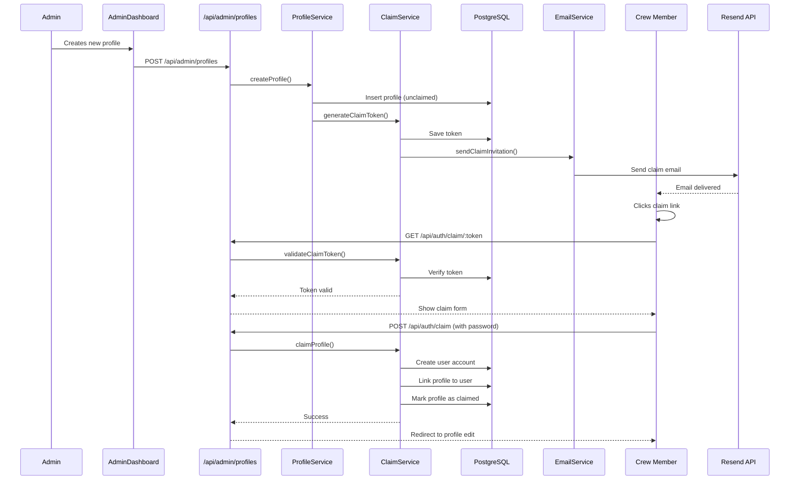
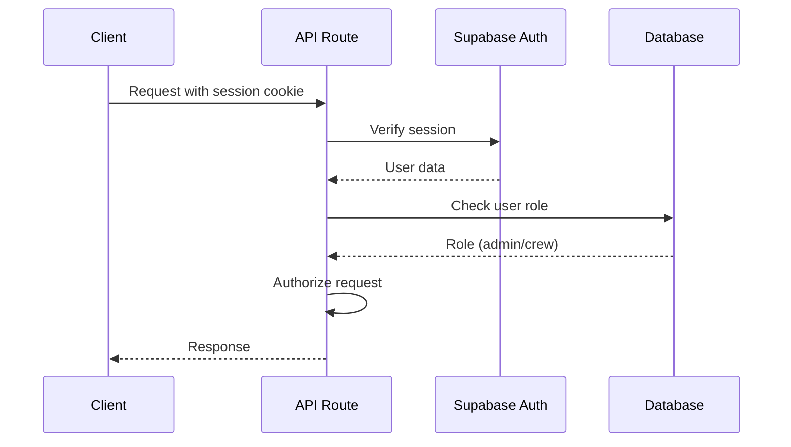
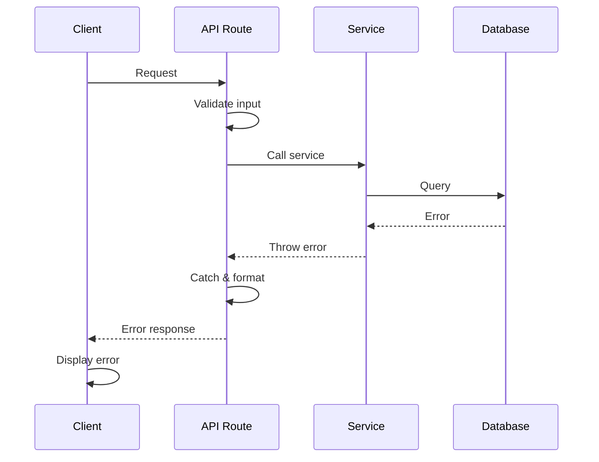

# Crew Up Fullstack Architecture Document

Version: 1.0  
Date: December 12, 2024  
Status: Draft

## Introduction

This document outlines the complete fullstack architecture for Crew Up, including backend systems, frontend implementation, and their integration. It serves as the single source of truth for AI-driven development, ensuring consistency across the entire technology stack.

This unified approach combines what would traditionally be separate backend and frontend architecture documents, streamlining the development process for modern fullstack applications where these concerns are increasingly intertwined.

### Starter Template or Existing Project

**N/A - Greenfield project**

Crew Up is a new greenfield project with no existing codebase or starter template dependencies. The architecture will be built from scratch using modern best practices.

### Change Log

| Date | Version | Description | Author |
|------|---------|-------------|--------|
| 2024-12-12 | 1.0 | Initial architecture document | Architect |

## High Level Architecture

### Technical Summary

Crew Up is built as a modern Jamstack application using Next.js 14+ with the App Router for server-side rendering (SSR), which is critical for SEO optimization. The architecture follows a monolithic fullstack approach where the Next.js application handles both frontend rendering and API routes, eliminating the need for a separate backend service. The platform leverages PostgreSQL via Supabase for data persistence, providing both the database and file storage capabilities. The entire application is deployed on Vercel, which offers seamless Next.js integration, edge functions, and automatic scaling. This architecture achieves the PRD's core goals by enabling fast, SEO-optimized crew profile pages that will rank highly in search results, while maintaining a simple, cost-effective infrastructure that can scale as the user base grows.

### Platform and Infrastructure Choice

**Platform:** Vercel + Supabase

**Rationale:**

After evaluating the PRD requirements, three platform options were considered:

1. **Vercel + Supabase** (Recommended)
   - **Pros:**
     - Native Next.js optimization and deployment
     - Built-in edge network for global performance
     - Supabase provides PostgreSQL, authentication, and storage in one platform
     - Zero-config deployments and automatic scaling
     - Cost-effective for MVP (generous free tier)
     - Excellent developer experience
   - **Cons:**
     - Vendor lock-in to Vercel ecosystem
     - Supabase has some limitations at very large scale

2. **AWS Full Stack (Lambda + RDS + S3)**
   - **Pros:**
     - Maximum flexibility and control
     - Enterprise-grade scalability
     - No vendor lock-in
   - **Cons:**
     - More complex setup and configuration
     - Higher operational overhead
     - More expensive for MVP stage
     - Requires more DevOps expertise

3. **Railway/Render + Supabase**
   - **Pros:**
     - Simple deployment
     - Good for small to medium scale
   - **Cons:**
     - Less optimized for Next.js than Vercel
     - Fewer edge locations
     - Less mature platform

**Selected Platform:** Vercel + Supabase

**Key Services:**
- **Vercel:** Frontend hosting, API routes, edge functions, CDN
- **Supabase:** PostgreSQL database, file storage (profile photos), authentication (for crew/admin accounts)
- **Resend:** Transactional email service (claim invitations, contact form notifications)
- **Vercel Analytics:** Performance and user analytics

**Deployment Host and Regions:**
- Primary: Vercel (Global Edge Network)
- Database: Supabase (US East region for primary, with read replicas available)
- Target: Global deployment with edge caching for optimal SEO performance

### Repository Structure

**Structure:** Monorepo (npm workspaces)

**Monorepo Tool:** npm workspaces (simple, no additional tooling needed for MVP)

**Package Organization:**
```
crew-up/
├── apps/
│   └── web/                    # Next.js application
├── packages/
│   ├── shared/                 # Shared TypeScript types and utilities
│   └── ui/                     # Shared UI components (future)
├── docs/                       # Documentation
└── package.json                # Root workspace config
```

**Rationale:**
- Monorepo enables code sharing between frontend and backend (Next.js API routes)
- Shared types package ensures type safety across the stack
- Simple npm workspaces sufficient for MVP scale
- Can migrate to Turborepo later if build performance becomes an issue
- Keeps structure simple while allowing future expansion

### High Level Architecture Diagram

```mermaid
graph TB
    User[User/Producer] -->|HTTPS| CDN[Vercel Edge CDN]
    CDN -->|SSR/Static| NextApp[Next.js App Router]
    
    NextApp -->|API Calls| APIRoutes[Next.js API Routes]
    APIRoutes -->|Query| Supabase[Supabase PostgreSQL]
    APIRoutes -->|Storage| SupabaseStorage[Supabase Storage]
    APIRoutes -->|Email| Resend[Resend Email Service]
    
    NextApp -->|SEO| Google[Google Search]
    Google -->|Crawls| NextApp
    
    Admin[Admin User] -->|Auth| SupabaseAuth[Supabase Auth]
    Crew[Crew Member] -->|Auth| SupabaseAuth
    SupabaseAuth -->|Session| NextApp
    
    style NextApp fill:#0070f3
    style Supabase fill:#3ecf8e
    style CDN fill:#000000
```



### Architectural Patterns

- **Jamstack Architecture:** Static site generation with serverless API routes - _Rationale:_ Optimal performance and SEO for content-heavy crew profile pages, enables fast page loads critical for search rankings

- **Server-Side Rendering (SSR):** All crew profile pages rendered server-side - _Rationale:_ Essential for SEO as search engines need fully rendered HTML with metadata and schema markup

- **Component-Based UI:** React components with TypeScript - _Rationale:_ Maintainability, type safety, and reusability across the application

- **Repository Pattern:** Abstract data access logic in API routes - _Rationale:_ Enables testing, future database migration flexibility, and clean separation of concerns

- **Progressive Enhancement:** Core functionality works without JavaScript - _Rationale:_ Better SEO, accessibility, and performance for users with slower connections

- **API-First Design:** Next.js API routes as backend endpoints - _Rationale:_ Clean separation, testability, and future flexibility to extract to separate service if needed

## Tech Stack

### Technology Stack Table

| Category | Technology | Version | Purpose | Rationale |
|----------|-----------|---------|---------|-----------|
| Frontend Language | TypeScript | 5.3+ | Type-safe frontend code | Prevents bugs, improves DX, enables shared types |
| Frontend Framework | Next.js | 14+ (App Router) | React framework with SSR | Critical for SEO, built-in optimizations, API routes |
| UI Component Library | shadcn/ui | Latest | Accessible component primitives | Customizable, accessible, Tailwind-based |
| State Management | React Server Components + Zustand | Latest | Server components + client state | Server components reduce client JS, Zustand for client state |
| Backend Language | TypeScript | 5.3+ | Type-safe backend code | Shared types with frontend, type safety |
| Backend Framework | Next.js API Routes | 14+ | Serverless API endpoints | Integrated with frontend, simple deployment |
| API Style | REST | - | RESTful API design | Simple, standard, easy to understand |
| Database | PostgreSQL | 15+ | Relational database | Via Supabase, excellent for structured crew data |
| Cache | Vercel Edge Cache + React Cache | - | Edge caching + React cache | Built-in Next.js caching, edge performance |
| File Storage | Supabase Storage | - | Profile photos and media | Integrated with Supabase, simple API |
| Authentication | Supabase Auth | - | User authentication | Built-in, secure, handles sessions |
| Frontend Testing | Vitest + React Testing Library | Latest | Unit and component tests | Fast, modern, great DX |
| Backend Testing | Vitest + Supertest | Latest | API route testing | Same test runner, consistent tooling |
| E2E Testing | Playwright | Latest | End-to-end testing | Reliable, fast, great for critical flows |
| Build Tool | Next.js (Turbopack) | 14+ | Build and bundling | Built-in, fast, optimized |
| Bundler | Turbopack | - | Fast bundling | Next.js default, significantly faster than Webpack |
| IaC Tool | Vercel CLI | - | Infrastructure as code | Platform-native, simple deployments |
| CI/CD | GitHub Actions | - | Continuous integration | Free for public repos, well-integrated |
| Monitoring | Vercel Analytics + Sentry | - | Performance and error tracking | Built-in analytics, Sentry for errors |
| Logging | Vercel Logs + Supabase Logs | - | Application logging | Platform-native logging |
| CSS Framework | Tailwind CSS | 3.4+ | Utility-first CSS | Fast development, consistent design |

## Data Models

### User

**Purpose:** Represents authenticated users (crew members and admins) in the system. Handles authentication and authorization.

**Key Attributes:**
- `id`: UUID - Primary key, Supabase-generated
- `email`: string - Unique email address for login
- `password_hash`: string - Hashed password (handled by Supabase Auth)
- `role`: enum('admin', 'crew') - User role determining permissions
- `created_at`: timestamp - Account creation time
- `updated_at`: timestamp - Last update time

**TypeScript Interface:**
```typescript
interface User {
  id: string;
  email: string;
  role: 'admin' | 'crew';
  created_at: string;
  updated_at: string;
}
```

**Relationships:**
- One-to-one with Profile (crew members only)
- Managed by Supabase Auth (extended with custom role field)

### Profile

**Purpose:** Core entity representing a crew member's public profile. Contains all information displayed on profile pages and used in search.

**Key Attributes:**
- `id`: UUID - Primary key
- `user_id`: UUID (nullable) - Foreign key to User, null if unclaimed
- `name`: string - Full name of crew member
- `primary_role`: string - Main role/title (e.g., "1st AC", "Gaffer")
- `primary_location_city`: string - Primary city
- `primary_location_state`: string - Primary state (2-letter code)
- `bio`: string (nullable, max 250 chars) - Short bio/about section
- `photo_url`: string (nullable) - URL to profile photo in Supabase Storage
- `contact_email`: string - Email for contact form submissions
- `contact_phone`: string (nullable) - Phone number
- `portfolio_url`: string (nullable) - Link to reel/portfolio
- `website`: string (nullable) - Personal website
- `instagram_url`: string (nullable) - Instagram profile
- `vimeo_url`: string (nullable) - Vimeo profile
- `union_status`: enum('union', 'non-union', 'either') (nullable) - Union affiliation
- `years_experience`: integer (nullable) - Years of experience
- `secondary_roles`: string[] (nullable) - Array of additional roles
- `additional_markets`: jsonb (nullable) - Array of {city, state} objects for other markets
- `is_claimed`: boolean - Whether profile has been claimed by crew member
- `claim_token`: string (nullable) - Unique token for profile claiming
- `claim_token_expires_at`: timestamp (nullable) - Token expiration
- `slug`: string - URL-friendly identifier (e.g., "sarah-martinez-gaffer-nashville")
- `created_at`: timestamp - Profile creation time
- `updated_at`: timestamp - Last update time

**TypeScript Interface:**
```typescript
interface Profile {
  id: string;
  user_id: string | null;
  name: string;
  primary_role: string;
  primary_location_city: string;
  primary_location_state: string;
  bio: string | null;
  photo_url: string | null;
  contact_email: string;
  contact_phone: string | null;
  portfolio_url: string | null;
  website: string | null;
  instagram_url: string | null;
  vimeo_url: string | null;
  union_status: 'union' | 'non-union' | 'either' | null;
  years_experience: number | null;
  secondary_roles: string[] | null;
  additional_markets: Array<{city: string; state: string}> | null;
  is_claimed: boolean;
  claim_token: string | null;
  claim_token_expires_at: string | null;
  slug: string;
  created_at: string;
  updated_at: string;
}
```

**Relationships:**
- One-to-many with Credit (a profile has many credits)
- One-to-one with User (if claimed)
- Many-to-many with ContactInquiry (through contact form submissions)

### Credit

**Purpose:** Represents a crew member's work credits/projects. Displayed on profile pages to showcase experience.

**Key Attributes:**
- `id`: UUID - Primary key
- `profile_id`: UUID - Foreign key to Profile
- `project_title`: string - Name of the project
- `role`: string - Role on this specific project
- `project_type`: enum('commercial', 'feature_film', 'documentary', 'music_video', 'tv', 'corporate', 'other') - Type of project
- `year`: integer - Year project was completed
- `production_company`: string (nullable) - Production company name
- `director`: string (nullable) - Director name
- `display_order`: integer - Order for display on profile (lower = higher priority)
- `created_at`: timestamp - Credit creation time
- `updated_at`: timestamp - Last update time

**TypeScript Interface:**
```typescript
interface Credit {
  id: string;
  profile_id: string;
  project_title: string;
  role: string;
  project_type: 'commercial' | 'feature_film' | 'documentary' | 'music_video' | 'tv' | 'corporate' | 'other';
  year: number;
  production_company: string | null;
  director: string | null;
  display_order: number;
  created_at: string;
  updated_at: string;
}
```

**Relationships:**
- Many-to-one with Profile (many credits belong to one profile)

### ContactInquiry

**Purpose:** Stores contact form submissions from producers to crew members. Used for analytics and potential future inquiry tracking.

**Key Attributes:**
- `id`: UUID - Primary key
- `profile_id`: UUID - Foreign key to Profile (crew member being contacted)
- `producer_name`: string - Name of producer submitting inquiry
- `producer_email`: string - Email of producer
- `producer_phone`: string (nullable) - Phone number
- `message`: string (max 500 chars) - Project details message
- `shoot_dates`: string (nullable) - Shoot date information
- `created_at`: timestamp - Inquiry submission time

**TypeScript Interface:**
```typescript
interface ContactInquiry {
  id: string;
  profile_id: string;
  producer_name: string;
  producer_email: string;
  producer_phone: string | null;
  message: string;
  shoot_dates: string | null;
  created_at: string;
}
```

**Relationships:**
- Many-to-one with Profile (many inquiries to one profile)

## API Specification

### REST API Specification

```yaml
openapi: 3.0.0
info:
  title: Crew Up API
  version: 1.0.0
  description: REST API for Crew Up production crew database platform
servers:
  - url: https://crew-up.vercel.app/api
    description: Production server
  - url: http://localhost:3000/api
    description: Local development server

paths:
  /profiles:
    get:
      summary: Search crew profiles
      parameters:
        - name: q
          in: query
          schema:
            type: string
          description: Search query (e.g., "AC in Nashville")
        - name: role
          in: query
          schema:
            type: string
          description: Filter by role
        - name: city
          in: query
          schema:
            type: string
          description: Filter by city
        - name: state
          in: query
          schema:
            type: string
          description: Filter by state
        - name: union_status
          in: query
          schema:
            type: string
            enum: [union, non-union, either]
          description: Filter by union status
        - name: page
          in: query
          schema:
            type: integer
            default: 1
          description: Page number
        - name: limit
          in: query
          schema:
            type: integer
            default: 20
          description: Results per page
      responses:
        '200':
          description: Successful response
          content:
            application/json:
              schema:
                type: object
                properties:
                  profiles:
                    type: array
                    items:
                      $ref: '#/components/schemas/Profile'
                  pagination:
                    $ref: '#/components/schemas/Pagination'

  /profiles/{slug}:
    get:
      summary: Get profile by slug
      parameters:
        - name: slug
          in: path
          required: true
          schema:
            type: string
          description: Profile slug
      responses:
        '200':
          description: Profile found
          content:
            application/json:
              schema:
                $ref: '#/components/schemas/ProfileWithCredits'
        '404':
          description: Profile not found

  /profiles/{id}/contact:
    post:
      summary: Submit contact inquiry
      requestBody:
        required: true
        content:
          application/json:
            schema:
              type: object
              required:
                - producer_name
                - producer_email
                - message
              properties:
                producer_name:
                  type: string
                producer_email:
                  type: string
                  format: email
                producer_phone:
                  type: string
                message:
                  type: string
                  maxLength: 500
                shoot_dates:
                  type: string
      responses:
        '200':
          description: Inquiry submitted successfully
        '400':
          description: Invalid request
        '429':
          description: Rate limit exceeded

  /admin/profiles:
    post:
      summary: Create new profile (admin only)
      security:
        - bearerAuth: []
      requestBody:
        required: true
        content:
          application/json:
            schema:
              $ref: '#/components/schemas/CreateProfileRequest'
      responses:
        '201':
          description: Profile created
        '401':
          description: Unauthorized

  /admin/profiles/bulk-import:
    post:
      summary: Bulk import profiles (admin only)
      security:
        - bearerAuth: []
      requestBody:
        required: true
        content:
          multipart/form-data:
            schema:
              type: object
              properties:
                file:
                  type: string
                  format: binary
      responses:
        '200':
          description: Import completed

  /auth/claim/{token}:
    get:
      summary: Verify claim token
      parameters:
        - name: token
          in: path
          required: true
          schema:
            type: string
      responses:
        '200':
          description: Token valid
        '404':
          description: Token invalid or expired

    post:
      summary: Claim profile
      requestBody:
        required: true
        content:
          application/json:
            schema:
              type: object
              required:
                - token
                - email
                - password
              properties:
                token:
                  type: string
                email:
                  type: string
                  format: email
                password:
                  type: string
      responses:
        '200':
          description: Profile claimed successfully
        '400':
          description: Invalid request

components:
  schemas:
    Profile:
      type: object
      properties:
        id:
          type: string
          format: uuid
        name:
          type: string
        primary_role:
          type: string
        primary_location_city:
          type: string
        primary_location_state:
          type: string
        slug:
          type: string
        photo_url:
          type: string
          nullable: true
        bio:
          type: string
          nullable: true
        union_status:
          type: string
          enum: [union, non-union, either]
          nullable: true

    ProfileWithCredits:
      allOf:
        - $ref: '#/components/schemas/Profile'
        - type: object
          properties:
            credits:
              type: array
              items:
                $ref: '#/components/schemas/Credit'

    Credit:
      type: object
      properties:
        id:
          type: string
        project_title:
          type: string
        role:
          type: string
        project_type:
          type: string
        year:
          type: integer

    Pagination:
      type: object
      properties:
        page:
          type: integer
        limit:
          type: integer
        total:
          type: integer
        totalPages:
          type: integer

    CreateProfileRequest:
      type: object
      required:
        - name
        - primary_role
        - primary_location_city
        - primary_location_state
        - contact_email
      properties:
        name:
          type: string
        primary_role:
          type: string
        primary_location_city:
          type: string
        primary_location_state:
          type: string
        contact_email:
          type: string
          format: email
        # ... other optional fields

  securitySchemes:
    bearerAuth:
      type: http
      scheme: bearer
      bearerFormat: JWT
```

## Components

### Frontend Components

#### SearchInterface
**Responsibility:** Primary search interface for producers to find crew. Handles search input, filters, and results display.

**Key Interfaces:**
- `handleSearch(query: string, filters: SearchFilters): Promise<SearchResults>`
- `handleFilterChange(filter: string, value: any): void`

**Dependencies:** API routes (`/api/profiles`), SearchService

**Technology Stack:** Next.js Server Component with Client Component for interactivity, React Hook Form for filters

#### ProfileCard
**Responsibility:** Displays crew profile summary in search results. Shows name, photo, role, location, and top credits.

**Key Interfaces:**
- Props: `profile: Profile`, `onContact: () => void`

**Dependencies:** None (presentational component)

**Technology Stack:** React Server Component, Tailwind CSS

#### ProfilePage
**Responsibility:** Full crew profile page with all details, credits, and contact form. Server-rendered for SEO.

**Key Interfaces:**
- Server Component that fetches profile data
- Client Component for contact form submission

**Dependencies:** API routes (`/api/profiles/[slug]`), ContactService

**Technology Stack:** Next.js Server Component, React Server Components, shadcn/ui components

#### ContactForm
**Responsibility:** Contact form for producers to reach out to crew members. Includes validation and rate limiting.

**Key Interfaces:**
- `onSubmit(data: ContactFormData): Promise<void>`

**Dependencies:** API routes (`/api/profiles/[id]/contact`), Resend email service

**Technology Stack:** React Hook Form, Zod validation, shadcn/ui form components

#### AdminDashboard
**Responsibility:** Admin interface for managing profiles, bulk imports, and viewing analytics.

**Key Interfaces:**
- `createProfile(data: CreateProfileData): Promise<Profile>`
- `bulkImport(file: File): Promise<ImportResult>`
- `getAnalytics(): Promise<Analytics>`

**Dependencies:** API routes (`/api/admin/*`), Supabase client

**Technology Stack:** Next.js App Router, React Server Components, shadcn/ui data tables

### Backend Components

#### ProfileService
**Responsibility:** Business logic for profile operations - search, retrieval, creation, updates.

**Key Interfaces:**
- `searchProfiles(query: SearchQuery): Promise<Profile[]>`
- `getProfileBySlug(slug: string): Promise<Profile | null>`
- `createProfile(data: CreateProfileData): Promise<Profile>`
- `updateProfile(id: string, data: UpdateProfileData): Promise<Profile>`

**Dependencies:** Database repository, SlugService

**Technology Stack:** TypeScript service layer, Supabase client

#### SearchService
**Responsibility:** Handles search query parsing and database queries. Implements full-text search and filtering.

**Key Interfaces:**
- `parseSearchQuery(query: string): ParsedQuery`
- `buildSearchQuery(parsed: ParsedQuery, filters: Filters): SQLQuery`
- `executeSearch(query: SQLQuery): Promise<Profile[]>`

**Dependencies:** Database repository, PostgreSQL full-text search

**Technology Stack:** PostgreSQL full-text search, query builder

#### ClaimService
**Responsibility:** Manages profile claiming flow - token generation, validation, and profile ownership transfer.

**Key Interfaces:**
- `generateClaimToken(profileId: string): Promise<string>`
- `validateClaimToken(token: string): Promise<Profile | null>`
- `claimProfile(token: string, userData: ClaimData): Promise<void>`
- `sendClaimEmail(profile: Profile, token: string): Promise<void>`

**Dependencies:** Database repository, EmailService, Supabase Auth

**Technology Stack:** TypeScript service, Resend API, Supabase Auth

#### EmailService
**Responsibility:** Sends transactional emails - claim invitations, contact form notifications, reminders.

**Key Interfaces:**
- `sendClaimInvitation(profile: Profile, token: string): Promise<void>`
- `sendContactNotification(profile: Profile, inquiry: ContactInquiry): Promise<void>`
- `sendClaimReminder(profile: Profile, token: string): Promise<void>`

**Dependencies:** Resend API

**Technology Stack:** Resend SDK, React Email templates

#### SEOService
**Responsibility:** Generates SEO metadata, schema markup, and sitemaps for all profile pages.

**Key Interfaces:**
- `generateMetadata(profile: Profile): Metadata`
- `generateSchemaMarkup(profile: Profile): JSON-LD`
- `generateSitemap(): Promise<Sitemap>`

**Dependencies:** ProfileService

**Technology Stack:** Next.js Metadata API, JSON-LD generation

### Component Diagrams

```mermaid
graph TB
    subgraph "Frontend Layer"
        SearchUI[SearchInterface]
        ProfilePage[ProfilePage]
        ContactForm[ContactForm]
        AdminUI[AdminDashboard]
    end
    
    subgraph "API Layer"
        ProfileAPI[/api/profiles]
        ContactAPI[/api/profiles/:id/contact]
        AdminAPI[/api/admin/*]
        ClaimAPI[/api/auth/claim]
    end
    
    subgraph "Service Layer"
        ProfileSvc[ProfileService]
        SearchSvc[SearchService]
        ClaimSvc[ClaimService]
        EmailSvc[EmailService]
        SEOSvc[SEOService]
    end
    
    subgraph "Data Layer"
        DB[(PostgreSQL)]
        Storage[(Supabase Storage)]
        Auth[Supabase Auth]
    end
    
    subgraph "External Services"
        Resend[Resend Email]
        Google[Google Search]
    end
    
    SearchUI --> ProfileAPI
    ProfilePage --> ProfileAPI
    ProfilePage --> ContactAPI
    ContactForm --> ContactAPI
    AdminUI --> AdminAPI
    
    ProfileAPI --> ProfileSvc
    ProfileAPI --> SearchSvc
    ContactAPI --> EmailSvc
    AdminAPI --> ProfileSvc
    ClaimAPI --> ClaimSvc
    
    ProfileSvc --> DB
    SearchSvc --> DB
    ClaimSvc --> DB
    ClaimSvc --> Auth
    EmailSvc --> Resend
    SEOSvc --> ProfileSvc
    
    ProfileSvc --> Storage
    ProfilePage --> SEOSvc
    SEOSvc --> Google
    
    style ProfileSvc fill:#3ecf8e
    style DB fill:#336791
    style SearchSvc fill:#3ecf8e
```

## External APIs

### Resend Email API

- **Purpose:** Send transactional emails (claim invitations, contact notifications, reminders)
- **Documentation:** https://resend.com/docs
- **Base URL(s):** `https://api.resend.com`
- **Authentication:** API key in environment variable
- **Rate Limits:** 100 emails/day on free tier, 50,000/month on paid plans

**Key Endpoints Used:**
- `POST /emails` - Send email with React Email template

**Integration Notes:**
- Use React Email for template design
- Store API key in Vercel environment variables
- Implement retry logic for failed sends
- Log all email sends for debugging

### Supabase APIs

- **Purpose:** Database queries, file storage, authentication
- **Documentation:** https://supabase.com/docs
- **Base URL(s):** Project-specific Supabase URL
- **Authentication:** Service role key for server-side, anon key for client
- **Rate Limits:** Based on Supabase plan (generous on free tier)

**Key Endpoints Used:**
- PostgreSQL: Direct SQL queries via Supabase client
- Storage API: Upload/download profile photos
- Auth API: User authentication and session management

**Integration Notes:**
- Use Supabase client library for type-safe queries
- Implement Row Level Security (RLS) policies for data access
- Use service role key only in API routes (never expose to client)

## Core Workflows

### Workflow 1: Producer Searches for Crew



### Workflow 2: Producer Contacts Crew Member



### Workflow 3: Admin Creates Profile & Crew Claims It



## Database Schema

### SQL Schema

```sql
-- Users table (managed by Supabase Auth, extended with role)
CREATE TABLE public.users (
    id UUID PRIMARY KEY DEFAULT gen_random_uuid(),
    email TEXT UNIQUE NOT NULL,
    role TEXT NOT NULL CHECK (role IN ('admin', 'crew')) DEFAULT 'crew',
    created_at TIMESTAMPTZ DEFAULT NOW(),
    updated_at TIMESTAMPTZ DEFAULT NOW()
);

-- Profiles table
CREATE TABLE public.profiles (
    id UUID PRIMARY KEY DEFAULT gen_random_uuid(),
    user_id UUID REFERENCES public.users(id) ON DELETE SET NULL,
    name TEXT NOT NULL,
    primary_role TEXT NOT NULL,
    primary_location_city TEXT NOT NULL,
    primary_location_state TEXT NOT NULL,
    bio TEXT CHECK (char_length(bio) <= 250),
    photo_url TEXT,
    contact_email TEXT NOT NULL,
    contact_phone TEXT,
    portfolio_url TEXT,
    website TEXT,
    instagram_url TEXT,
    vimeo_url TEXT,
    union_status TEXT CHECK (union_status IN ('union', 'non-union', 'either')),
    years_experience INTEGER,
    secondary_roles TEXT[],
    additional_markets JSONB, -- Array of {city, state} objects
    is_claimed BOOLEAN DEFAULT FALSE,
    claim_token TEXT UNIQUE,
    claim_token_expires_at TIMESTAMPTZ,
    slug TEXT UNIQUE NOT NULL,
    created_at TIMESTAMPTZ DEFAULT NOW(),
    updated_at TIMESTAMPTZ DEFAULT NOW()
);

-- Credits table
CREATE TABLE public.credits (
    id UUID PRIMARY KEY DEFAULT gen_random_uuid(),
    profile_id UUID NOT NULL REFERENCES public.profiles(id) ON DELETE CASCADE,
    project_title TEXT NOT NULL,
    role TEXT NOT NULL,
    project_type TEXT NOT NULL CHECK (project_type IN ('commercial', 'feature_film', 'documentary', 'music_video', 'tv', 'corporate', 'other')),
    year INTEGER NOT NULL,
    production_company TEXT,
    director TEXT,
    display_order INTEGER DEFAULT 0,
    created_at TIMESTAMPTZ DEFAULT NOW(),
    updated_at TIMESTAMPTZ DEFAULT NOW()
);

-- Contact inquiries table
CREATE TABLE public.contact_inquiries (
    id UUID PRIMARY KEY DEFAULT gen_random_uuid(),
    profile_id UUID NOT NULL REFERENCES public.profiles(id) ON DELETE CASCADE,
    producer_name TEXT NOT NULL,
    producer_email TEXT NOT NULL,
    producer_phone TEXT,
    message TEXT NOT NULL CHECK (char_length(message) <= 500),
    shoot_dates TEXT,
    created_at TIMESTAMPTZ DEFAULT NOW()
);

-- Indexes for performance
CREATE INDEX idx_profiles_slug ON public.profiles(slug);
CREATE INDEX idx_profiles_location ON public.profiles(primary_location_city, primary_location_state);
CREATE INDEX idx_profiles_role ON public.profiles(primary_role);
CREATE INDEX idx_profiles_claimed ON public.profiles(is_claimed);
CREATE INDEX idx_profiles_claim_token ON public.profiles(claim_token) WHERE claim_token IS NOT NULL;

-- Full-text search index
CREATE INDEX idx_profiles_search ON public.profiles 
    USING gin(to_tsvector('english', 
        coalesce(name, '') || ' ' || 
        coalesce(primary_role, '') || ' ' || 
        coalesce(bio, '') || ' ' ||
        coalesce(primary_location_city, '') || ' ' ||
        coalesce(primary_location_state, '')
    ));

CREATE INDEX idx_credits_profile ON public.credits(profile_id);
CREATE INDEX idx_credits_display_order ON public.credits(profile_id, display_order);
CREATE INDEX idx_contact_inquiries_profile ON public.contact_inquiries(profile_id);
CREATE INDEX idx_contact_inquiries_created ON public.contact_inquiries(created_at);

-- Updated_at trigger function
CREATE OR REPLACE FUNCTION update_updated_at_column()
RETURNS TRIGGER AS $$
BEGIN
    NEW.updated_at = NOW();
    RETURN NEW;
END;
$$ language 'plpgsql';

-- Apply updated_at triggers
CREATE TRIGGER update_profiles_updated_at BEFORE UPDATE ON public.profiles
    FOR EACH ROW EXECUTE FUNCTION update_updated_at_column();

CREATE TRIGGER update_credits_updated_at BEFORE UPDATE ON public.credits
    FOR EACH ROW EXECUTE FUNCTION update_updated_at_column();

-- Row Level Security (RLS) policies
ALTER TABLE public.profiles ENABLE ROW LEVEL SECURITY;
ALTER TABLE public.credits ENABLE ROW LEVEL SECURITY;
ALTER TABLE public.contact_inquiries ENABLE ROW LEVEL SECURITY;

-- Profiles: Public read, authenticated write for own profile, admin full access
CREATE POLICY "Profiles are viewable by everyone" ON public.profiles
    FOR SELECT USING (true);

CREATE POLICY "Users can update own profile" ON public.profiles
    FOR UPDATE USING (auth.uid() = user_id);

CREATE POLICY "Admins can insert profiles" ON public.profiles
    FOR INSERT WITH CHECK (
        EXISTS (
            SELECT 1 FROM public.users 
            WHERE id = auth.uid() AND role = 'admin'
        )
    );

-- Credits: Public read, authenticated write for own profile's credits
CREATE POLICY "Credits are viewable by everyone" ON public.credits
    FOR SELECT USING (true);

CREATE POLICY "Users can manage own profile credits" ON public.credits
    FOR ALL USING (
        EXISTS (
            SELECT 1 FROM public.profiles 
            WHERE id = profile_id AND user_id = auth.uid()
        )
    );

-- Contact inquiries: Only admins can view, anyone can create
CREATE POLICY "Anyone can create inquiries" ON public.contact_inquiries
    FOR INSERT WITH CHECK (true);

CREATE POLICY "Admins can view inquiries" ON public.contact_inquiries
    FOR SELECT USING (
        EXISTS (
            SELECT 1 FROM public.users 
            WHERE id = auth.uid() AND role = 'admin'
        )
    );
```

## Frontend Architecture

### Component Architecture

#### Component Organization

```
apps/web/src/
├── app/                          # Next.js App Router
│   ├── (public)/                 # Public routes
│   │   ├── page.tsx             # Homepage
│   │   ├── crew/                # Crew-related pages
│   │   │   ├── [slug]/          # Individual profile pages
│   │   │   │   └── page.tsx
│   │   │   ├── [city]-[state]/  # Location pages
│   │   │   │   └── page.tsx
│   │   │   └── [role]/          # Role pages
│   │   │       └── page.tsx
│   │   └── about/
│   │       └── page.tsx
│   ├── (auth)/                  # Auth-protected routes
│   │   ├── dashboard/           # Crew dashboard
│   │   │   └── page.tsx
│   │   └── admin/               # Admin dashboard
│   │       └── page.tsx
│   ├── api/                     # API routes
│   │   ├── profiles/
│   │   ├── auth/
│   │   └── admin/
│   ├── layout.tsx               # Root layout
│   └── globals.css              # Global styles
├── components/                  # React components
│   ├── ui/                      # shadcn/ui components
│   ├── search/                  # Search-related components
│   │   ├── SearchInterface.tsx
│   │   ├── SearchFilters.tsx
│   │   └── SearchResults.tsx
│   ├── profile/                 # Profile-related components
│   │   ├── ProfileCard.tsx
│   │   ├── ProfileHeader.tsx
│   │   ├── CreditsList.tsx
│   │   └── ContactForm.tsx
│   └── admin/                   # Admin components
│       ├── ProfileForm.tsx
│       ├── BulkImport.tsx
│       └── Analytics.tsx
├── lib/                         # Utilities and services
│   ├── supabase/               # Supabase client
│   ├── services/               # API service layer
│   │   ├── profileService.ts
│   │   ├── searchService.ts
│   │   └── contactService.ts
│   └── utils/                  # Helper functions
├── types/                       # TypeScript types
│   └── index.ts
└── hooks/                       # Custom React hooks
    ├── useSearch.ts
    └── useProfile.ts
```

#### Component Template

```typescript
// Example: ProfileCard.tsx
import { Profile } from '@/types';
import Image from 'next/image';
import Link from 'next/link';

interface ProfileCardProps {
  profile: Profile;
}

export function ProfileCard({ profile }: ProfileCardProps) {
  return (
    <Link href={`/crew/${profile.slug}`}>
      <article className="rounded-lg border p-4 hover:shadow-lg transition-shadow">
        <div className="flex gap-4">
          {profile.photo_url && (
            <Image
              src={profile.photo_url}
              alt={profile.name}
              width={80}
              height={80}
              className="rounded-full object-cover"
            />
          )}
          <div className="flex-1">
            <h3 className="font-semibold text-lg">{profile.name}</h3>
            <p className="text-muted-foreground">{profile.primary_role}</p>
            <p className="text-sm">
              {profile.primary_location_city}, {profile.primary_location_state}
            </p>
          </div>
        </div>
      </article>
    </Link>
  );
}
```

### State Management Architecture

#### State Structure

```typescript
// Using React Server Components + Zustand for client state
// Server Components handle data fetching
// Zustand stores client-side UI state

// stores/searchStore.ts
import { create } from 'zustand';

interface SearchState {
  query: string;
  filters: SearchFilters;
  results: Profile[];
  isLoading: boolean;
  setQuery: (query: string) => void;
  setFilters: (filters: SearchFilters) => void;
  setResults: (results: Profile[]) => void;
  setIsLoading: (loading: boolean) => void;
}

export const useSearchStore = create<SearchState>((set) => ({
  query: '',
  filters: {},
  results: [],
  isLoading: false,
  setQuery: (query) => set({ query }),
  setFilters: (filters) => set({ filters }),
  setResults: (results) => set({ results }),
  setIsLoading: (isLoading) => set({ isLoading }),
}));
```

#### State Management Patterns

- **Server Components for Data:** All initial data fetching happens in Server Components
- **Client Components for Interactivity:** Forms, search inputs, and interactive UI use Client Components
- **Zustand for Client State:** Only for UI state that needs to persist across navigation (search filters, etc.)
- **URL State for Search:** Search queries and filters stored in URL params for shareability and SEO
- **React Cache for Data:** Use React's `cache()` for request deduplication in Server Components

### Routing Architecture

#### Route Organization

```
/                           # Homepage with search
/crew/[slug]               # Individual profile pages (SSR for SEO)
/crew/[city]-[state]       # Location-based listings
/crew/[role]               # Role-based listings
/about                     # About page
/dashboard                 # Crew member dashboard (protected)
/admin                     # Admin dashboard (protected)
/api/*                     # API routes
```

#### Protected Route Pattern

```typescript
// app/(auth)/dashboard/page.tsx
import { redirect } from 'next/navigation';
import { createServerClient } from '@/lib/supabase/server';

export default async function DashboardPage() {
  const supabase = createServerClient();
  const { data: { user } } = await supabase.auth.getUser();
  
  if (!user) {
    redirect('/login');
  }
  
  // Fetch user's profile
  const { data: profile } = await supabase
    .from('profiles')
    .select('*')
    .eq('user_id', user.id)
    .single();
  
  return <DashboardContent profile={profile} />;
}
```

### Frontend Services Layer

#### API Client Setup

```typescript
// lib/services/apiClient.ts
const API_BASE_URL = process.env.NEXT_PUBLIC_API_URL || '/api';

export class ApiError extends Error {
  constructor(
    message: string,
    public status: number,
    public data?: unknown
  ) {
    super(message);
  }
}

async function fetchApi<T>(
  endpoint: string,
  options?: RequestInit
): Promise<T> {
  const response = await fetch(`${API_BASE_URL}${endpoint}`, {
    ...options,
    headers: {
      'Content-Type': 'application/json',
      ...options?.headers,
    },
  });
  
  if (!response.ok) {
    const error = await response.json().catch(() => ({}));
    throw new ApiError(
      error.message || 'An error occurred',
      response.status,
      error
    );
  }
  
  return response.json();
}

export const apiClient = {
  get: <T>(endpoint: string) => fetchApi<T>(endpoint),
  post: <T>(endpoint: string, data?: unknown) =>
    fetchApi<T>(endpoint, {
      method: 'POST',
      body: JSON.stringify(data),
    }),
};
```

#### Service Example

```typescript
// lib/services/profileService.ts
import { apiClient } from './apiClient';
import { Profile, SearchFilters, SearchResults } from '@/types';

export const profileService = {
  async search(query: string, filters: SearchFilters): Promise<SearchResults> {
    const params = new URLSearchParams({
      q: query,
      ...Object.entries(filters).reduce((acc, [key, value]) => {
        if (value) acc[key] = String(value);
        return acc;
      }, {} as Record<string, string>),
    });
    
    return apiClient.get<SearchResults>(`/profiles?${params}`);
  },
  
  async getBySlug(slug: string): Promise<Profile> {
    return apiClient.get<Profile>(`/profiles/${slug}`);
  },
  
  async contact(profileId: string, data: ContactFormData): Promise<void> {
    return apiClient.post(`/profiles/${profileId}/contact`, data);
  },
};
```

## Backend Architecture

### Service Architecture

#### Serverless Architecture (Next.js API Routes)

**Function Organization:**

```
app/api/
├── profiles/
│   ├── route.ts              # GET /api/profiles (search)
│   └── [slug]/
│       └── route.ts          # GET /api/profiles/[slug]
├── profiles/[id]/
│   └── contact/
│       └── route.ts          # POST /api/profiles/[id]/contact
├── admin/
│   ├── profiles/
│   │   ├── route.ts          # POST /api/admin/profiles
│   │   └── bulk-import/
│   │       └── route.ts     # POST /api/admin/profiles/bulk-import
│   └── analytics/
│       └── route.ts          # GET /api/admin/analytics
└── auth/
    └── claim/
        └── [token]/
            └── route.ts      # GET/POST /api/auth/claim/[token]
```

**Function Template:**

```typescript
// app/api/profiles/route.ts
import { NextRequest, NextResponse } from 'next/server';
import { createServerClient } from '@/lib/supabase/server';
import { profileService } from '@/lib/services/profileService';
import { z } from 'zod';

const searchSchema = z.object({
  q: z.string().optional(),
  role: z.string().optional(),
  city: z.string().optional(),
  state: z.string().optional(),
  union_status: z.enum(['union', 'non-union', 'either']).optional(),
  page: z.coerce.number().min(1).default(1),
  limit: z.coerce.number().min(1).max(100).default(20),
});

export async function GET(request: NextRequest) {
  try {
    const searchParams = request.nextUrl.searchParams;
    const params = searchSchema.parse(Object.fromEntries(searchParams));
    
    const results = await profileService.search(params);
    
    return NextResponse.json(results);
  } catch (error) {
    if (error instanceof z.ZodError) {
      return NextResponse.json(
        { error: 'Invalid request parameters', details: error.errors },
        { status: 400 }
      );
    }
    
    console.error('Search error:', error);
    return NextResponse.json(
      { error: 'Internal server error' },
      { status: 500 }
    );
  }
}
```

### Database Architecture

#### Data Access Layer

```typescript
// lib/repositories/profileRepository.ts
import { createServerClient } from '@/lib/supabase/server';
import { Profile, CreateProfileData } from '@/types';

export class ProfileRepository {
  private supabase = createServerClient();
  
  async findBySlug(slug: string): Promise<Profile | null> {
    const { data, error } = await this.supabase
      .from('profiles')
      .select('*, credits(*)')
      .eq('slug', slug)
      .single();
    
    if (error || !data) return null;
    return data;
  }
  
  async search(query: SearchQuery): Promise<Profile[]> {
    // Implement full-text search using PostgreSQL
    const { data, error } = await this.supabase
      .rpc('search_profiles', { search_query: query.text });
    
    if (error) throw error;
    return data || [];
  }
  
  async create(data: CreateProfileData): Promise<Profile> {
    const { data: profile, error } = await this.supabase
      .from('profiles')
      .insert(data)
      .select()
      .single();
    
    if (error) throw error;
    return profile;
  }
  
  async update(id: string, data: Partial<Profile>): Promise<Profile> {
    const { data: profile, error } = await this.supabase
      .from('profiles')
      .update(data)
      .eq('id', id)
      .select()
      .single();
    
    if (error) throw error;
    return profile;
  }
}
```

### Authentication and Authorization

#### Auth Flow



#### Middleware/Guards

```typescript
// lib/middleware/auth.ts
import { createServerClient } from '@/lib/supabase/server';
import { NextResponse } from 'next/server';
import type { NextRequest } from 'next/server';

export async function requireAuth(request: NextRequest) {
  const supabase = createServerClient();
  const { data: { user }, error } = await supabase.auth.getUser();
  
  if (error || !user) {
    return NextResponse.json(
      { error: 'Unauthorized' },
      { status: 401 }
    );
  }
  
  return { user, supabase };
}

export async function requireAdmin(request: NextRequest) {
  const auth = await requireAuth(request);
  if (auth instanceof NextResponse) return auth;
  
  const { user, supabase } = auth;
  
  const { data: userData } = await supabase
    .from('users')
    .select('role')
    .eq('id', user.id)
    .single();
  
  if (userData?.role !== 'admin') {
    return NextResponse.json(
      { error: 'Forbidden' },
      { status: 403 }
    );
  }
  
  return { user, supabase };
}

// Usage in API route:
// app/api/admin/profiles/route.ts
export async function POST(request: NextRequest) {
  const auth = await requireAdmin(request);
  if (auth instanceof NextResponse) return auth;
  
  // Proceed with admin-only logic
}
```

## Unified Project Structure

```
crew-up/
├── .github/                    # CI/CD workflows
│   └── workflows/
│       ├── ci.yml             # Continuous integration
│       └── deploy.yml         # Deployment
├── apps/
│   └── web/                   # Next.js application
│       ├── app/               # App Router
│       │   ├── (public)/      # Public routes
│       │   ├── (auth)/        # Auth-protected routes
│       │   └── api/           # API routes
│       ├── components/        # React components
│       ├── lib/               # Utilities and services
│       ├── types/             # TypeScript types
│       ├── hooks/             # Custom hooks
│       ├── public/            # Static assets
│       ├── tests/             # Tests
│       ├── next.config.js     # Next.js config
│       ├── tailwind.config.js # Tailwind config
│       └── package.json
├── packages/
│   └── shared/                # Shared code
│       ├── src/
│       │   ├── types/         # Shared TypeScript types
│       │   ├── constants/     # Shared constants
│       │   └── utils/         # Shared utilities
│       └── package.json
├── docs/                      # Documentation
│   ├── prd/
│   │   └── prd.md
│   └── architecture.md
├── .env.example               # Environment template
├── .gitignore
├── package.json               # Root workspace config
├── pnpm-workspace.yaml        # Workspace config
└── README.md
```

## Development Workflow

### Local Development Setup

#### Prerequisites

```bash
# Required
- Node.js 18+ 
- pnpm 8+ (or npm/yarn)
- Supabase account (free tier works)
- Vercel account (for deployment)

# Optional but recommended
- VS Code with extensions:
  - ESLint
  - Prettier
  - Tailwind CSS IntelliSense
  - TypeScript
```

#### Initial Setup

```bash
# Clone repository
git clone <repo-url>
cd crew-up

# Install dependencies
pnpm install

# Set up environment variables
cp .env.example .env.local
# Edit .env.local with your Supabase credentials

# Set up Supabase
# 1. Create new Supabase project
# 2. Run database migrations (schema.sql)
# 3. Configure storage bucket for profile photos
# 4. Set up Resend API key

# Run database migrations
pnpm db:migrate

# Start development server
pnpm dev
```

#### Development Commands

```bash
# Start all services (frontend + API)
pnpm dev

# Start frontend only (if separated later)
pnpm dev:web

# Start backend only (if separated later)
pnpm dev:api

# Run tests
pnpm test              # All tests
pnpm test:unit          # Unit tests only
pnpm test:integration   # Integration tests only
pnpm test:e2e           # E2E tests only

# Type checking
pnpm type-check

# Linting
pnpm lint
pnpm lint:fix

# Build for production
pnpm build

# Start production server locally
pnpm start
```

### Environment Configuration

#### Required Environment Variables

```bash
# Frontend (.env.local)
NEXT_PUBLIC_SUPABASE_URL=https://your-project.supabase.co
NEXT_PUBLIC_SUPABASE_ANON_KEY=your-anon-key
NEXT_PUBLIC_API_URL=/api  # For local dev, use /api

# Backend (same file, server-side only)
SUPABASE_SERVICE_ROLE_KEY=your-service-role-key
RESEND_API_KEY=re_xxxxxxxxxxxxx
NODE_ENV=development

# Shared
DATABASE_URL=postgresql://...  # Supabase connection string
```

## Deployment Architecture

### Deployment Strategy

**Frontend Deployment:**
- **Platform:** Vercel
- **Build Command:** `pnpm build`
- **Output Directory:** `.next`
- **CDN/Edge:** Vercel Edge Network (automatic)

**Backend Deployment:**
- **Platform:** Vercel (Next.js API Routes)
- **Build Command:** `pnpm build` (included in Next.js build)
- **Deployment Method:** Automatic on git push to main branch

**Database:**
- **Platform:** Supabase (managed PostgreSQL)
- **Backup:** Automatic daily backups (Supabase managed)
- **Migrations:** Run via Supabase CLI or dashboard

### CI/CD Pipeline

```yaml
# .github/workflows/ci.yml
name: CI

on:
  push:
    branches: [main, develop]
  pull_request:
    branches: [main]

jobs:
  test:
    runs-on: ubuntu-latest
    steps:
      - uses: actions/checkout@v3
      - uses: pnpm/action-setup@v2
        with:
          version: 8
      - uses: actions/setup-node@v3
        with:
          node-version: 18
          cache: 'pnpm'
      
      - run: pnpm install
      - run: pnpm lint
      - run: pnpm type-check
      - run: pnpm test
      - run: pnpm build

  deploy:
    needs: test
    runs-on: ubuntu-latest
    if: github.ref == 'refs/heads/main'
    steps:
      - uses: actions/checkout@v3
      - uses: amondnet/vercel-action@v20
        with:
          vercel-token: ${{ secrets.VERCEL_TOKEN }}
          vercel-org-id: ${{ secrets.VERCEL_ORG_ID }}
          vercel-project-id: ${{ secrets.VERCEL_PROJECT_ID }}
```

### Environments

| Environment | Frontend URL | Backend URL | Purpose |
|-------------|--------------|-------------|---------|
| Development | localhost:3000 | localhost:3000/api | Local development |
| Preview | *.vercel.app | *.vercel.app/api | PR preview deployments |
| Production | crew-up.vercel.app | crew-up.vercel.app/api | Live environment |

## Security and Performance

### Security Requirements

**Frontend Security:**
- **CSP Headers:** Content Security Policy via Next.js headers
- **XSS Prevention:** React's built-in escaping, sanitize user inputs
- **Secure Storage:** No sensitive data in localStorage, use httpOnly cookies for sessions

**Backend Security:**
- **Input Validation:** Zod schemas for all API inputs
- **Rate Limiting:** Vercel Edge Config for rate limiting (contact forms: 5 per hour per IP)
- **CORS Policy:** Restrict to allowed origins only
- **SQL Injection Prevention:** Use Supabase client (parameterized queries)

**Authentication Security:**
- **Token Storage:** httpOnly cookies (Supabase default)
- **Session Management:** Supabase Auth handles session refresh
- **Password Policy:** Minimum 8 characters, enforced by Supabase

### Performance Optimization

**Frontend Performance:**
- **Bundle Size Target:** <200KB initial JS bundle (gzipped)
- **Loading Strategy:** Server Components + React Suspense for progressive loading
- **Caching Strategy:** 
  - Static profile pages: ISR with 1 hour revalidation
  - Search results: 5 minute cache
  - Images: Next.js Image optimization with CDN

**Backend Performance:**
- **Response Time Target:** <200ms for API routes (excluding external calls)
- **Database Optimization:** 
  - Indexes on all search columns
  - Full-text search index for profile search
  - Connection pooling via Supabase
- **Caching Strategy:**
  - Vercel Edge Cache for API responses (5 min TTL)
  - React Cache for request deduplication

## Testing Strategy

### Testing Pyramid

```
        E2E Tests (Playwright)
       /                    \
   Integration Tests (Vitest)
   /                          \
Frontend Unit (RTL)    Backend Unit (Vitest)
```

### Test Organization

**Frontend Tests:**
```
apps/web/tests/
├── unit/
│   ├── components/
│   └── hooks/
├── integration/
│   └── services/
└── __mocks__/
```

**Backend Tests:**
```
apps/web/tests/
├── unit/
│   └── services/
├── integration/
│   └── api/
└── __fixtures__/
```

**E2E Tests:**
```
tests/e2e/
├── search.spec.ts
├── profile.spec.ts
├── contact.spec.ts
└── admin.spec.ts
```

### Test Examples

**Frontend Component Test:**
```typescript
// tests/unit/components/ProfileCard.test.tsx
import { render, screen } from '@testing-library/react';
import { ProfileCard } from '@/components/profile/ProfileCard';
import { Profile } from '@/types';

describe('ProfileCard', () => {
  it('displays profile information', () => {
    const profile: Profile = {
      id: '1',
      name: 'John Doe',
      primary_role: 'Gaffer',
      primary_location_city: 'Nashville',
      primary_location_state: 'TN',
      slug: 'john-doe-gaffer-nashville',
      // ... other fields
    };
    
    render(<ProfileCard profile={profile} />);
    
    expect(screen.getByText('John Doe')).toBeInTheDocument();
    expect(screen.getByText('Gaffer')).toBeInTheDocument();
    expect(screen.getByText('Nashville, TN')).toBeInTheDocument();
  });
});
```

**Backend API Test:**
```typescript
// tests/integration/api/profiles.test.ts
import { describe, it, expect } from 'vitest';
import { createMocks } from 'node-mocks-http';
import { GET } from '@/app/api/profiles/route';

describe('/api/profiles', () => {
  it('returns profiles for valid search', async () => {
    const { req, res } = createMocks({
      method: 'GET',
      url: '/api/profiles?q=gaffer&city=Nashville',
    });
    
    await GET(req as any);
    
    expect(res._getStatusCode()).toBe(200);
    const data = JSON.parse(res._getData());
    expect(data.profiles).toBeInstanceOf(Array);
  });
});
```

**E2E Test:**
```typescript
// tests/e2e/search.spec.ts
import { test, expect } from '@playwright/test';

test('producer can search for crew', async ({ page }) => {
  await page.goto('/');
  
  await page.fill('input[placeholder*="search"]', 'gaffer in Nashville');
  await page.click('button[type="submit"]');
  
  await expect(page.locator('text=Gaffer')).toBeVisible();
  await expect(page.locator('text=Nashville')).toBeVisible();
});
```

## Coding Standards

### Critical Fullstack Rules

- **Type Sharing:** Always define types in `packages/shared/src/types` and import from there. Never duplicate type definitions.
- **API Calls:** Never make direct HTTP calls in components. Always use the service layer (`lib/services/*`).
- **Environment Variables:** Access only through config objects (`lib/config`), never `process.env` directly in components.
- **Error Handling:** All API routes must use the standard error handler. Return consistent error format.
- **State Updates:** Never mutate state directly. Use proper state management patterns (Server Components for data, Zustand for UI state).
- **SEO Requirements:** All crew profile pages must be Server Components with proper metadata. No client-side rendering for profile content.
- **Database Queries:** Always use Supabase client, never raw SQL. Use Row Level Security policies.
- **File Uploads:** Profile photos must be uploaded to Supabase Storage, never stored in database as base64.

### Naming Conventions

| Element | Frontend | Backend | Example |
|---------|----------|---------|---------|
| Components | PascalCase | - | `ProfileCard.tsx` |
| Hooks | camelCase with 'use' | - | `useSearch.ts` |
| API Routes | - | kebab-case | `/api/profiles/[slug]` |
| Database Tables | - | snake_case | `user_profiles` |
| Services | camelCase | camelCase | `profileService.ts` |
| Types/Interfaces | PascalCase | PascalCase | `Profile`, `SearchFilters` |

## Error Handling Strategy

### Error Flow



### Error Response Format

```typescript
interface ApiError {
  error: {
    code: string;
    message: string;
    details?: Record<string, any>;
    timestamp: string;
    requestId: string;
  };
}
```

### Frontend Error Handling

```typescript
// lib/hooks/useApi.ts
import { useState } from 'react';
import { ApiError } from '@/lib/services/apiClient';

export function useApi<T>() {
  const [error, setError] = useState<ApiError | null>(null);
  const [isLoading, setIsLoading] = useState(false);
  
  const execute = async (fn: () => Promise<T>): Promise<T | null> => {
    try {
      setIsLoading(true);
      setError(null);
      return await fn();
    } catch (err) {
      if (err instanceof ApiError) {
        setError(err);
      } else {
        setError({
          error: {
            code: 'UNKNOWN_ERROR',
            message: 'An unexpected error occurred',
            timestamp: new Date().toISOString(),
            requestId: '',
          },
        });
      }
      return null;
    } finally {
      setIsLoading(false);
    }
  };
  
  return { execute, error, isLoading };
}
```

### Backend Error Handling

```typescript
// lib/utils/errorHandler.ts
import { NextResponse } from 'next/server';
import { ZodError } from 'zod';

export function handleError(error: unknown): NextResponse {
  if (error instanceof ZodError) {
    return NextResponse.json(
      {
        error: {
          code: 'VALIDATION_ERROR',
          message: 'Invalid request parameters',
          details: error.errors,
          timestamp: new Date().toISOString(),
          requestId: crypto.randomUUID(),
        },
      },
      { status: 400 }
    );
  }
  
  if (error instanceof Error) {
    return NextResponse.json(
      {
        error: {
          code: 'INTERNAL_ERROR',
          message: process.env.NODE_ENV === 'production' 
            ? 'Internal server error' 
            : error.message,
          timestamp: new Date().toISOString(),
          requestId: crypto.randomUUID(),
        },
      },
      { status: 500 }
    );
  }
  
  return NextResponse.json(
    {
      error: {
        code: 'UNKNOWN_ERROR',
        message: 'An unexpected error occurred',
        timestamp: new Date().toISOString(),
        requestId: crypto.randomUUID(),
      },
    },
    { status: 500 }
  );
}
```

## Monitoring and Observability

### Monitoring Stack

- **Frontend Monitoring:** Vercel Analytics (Core Web Vitals, page views)
- **Backend Monitoring:** Vercel Logs (API route performance, errors)
- **Error Tracking:** Sentry (error capture and alerting)
- **Performance Monitoring:** Vercel Analytics + Sentry Performance

### Key Metrics

**Frontend Metrics:**
- Core Web Vitals (LCP, FID, CLS)
- JavaScript errors (captured by Sentry)
- API response times (from frontend perspective)
- Page load times
- Search query performance

**Backend Metrics:**
- Request rate (requests per minute)
- Error rate (4xx, 5xx responses)
- Response time (p50, p95, p99)
- Database query performance
- API route execution time

**Business Metrics:**
- Profile views
- Search queries (top queries)
- Contact form submissions
- Profile claim rate
- User signups

## Checklist Results Report

_This section will be populated after running the architect checklist._

---

**Document Status:** Complete - Ready for Review

**Next Steps:**
1. Review architecture with team
2. Set up development environment
3. Initialize project structure
4. Begin implementation

