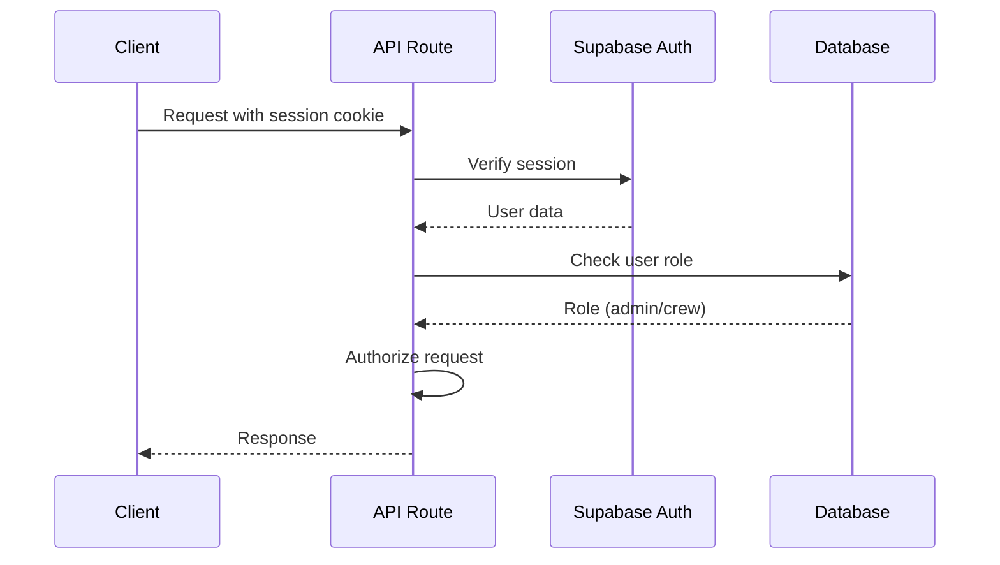

# Backend Architecture


## Service Architecture

### Serverless Architecture (Next.js API Routes)

**Function Organization:**

```
app/api/
├── profiles/
│   ├── route.ts              # GET /api/profiles (search)
│   └── [slug]/
│       └── route.ts          # GET /api/profiles/[slug]
├── profiles/[id]/
│   └── contact/
│       └── route.ts          # POST /api/profiles/[id]/contact
├── admin/
│   ├── profiles/
│   │   ├── route.ts          # POST /api/admin/profiles
│   │   └── bulk-import/
│   │       └── route.ts     # POST /api/admin/profiles/bulk-import
│   └── analytics/
│       └── route.ts          # GET /api/admin/analytics
└── auth/
    └── claim/
        └── [token]/
            └── route.ts      # GET/POST /api/auth/claim/[token]
```

**Function Template:**

```typescript
// app/api/profiles/route.ts
import { NextRequest, NextResponse } from 'next/server';
import { createServerClient } from '@/lib/supabase/server';
import { profileService } from '@/lib/services/profileService';
import { z } from 'zod';

const searchSchema = z.object({
  q: z.string().optional(),
  role: z.string().optional(),
  city: z.string().optional(),
  state: z.string().optional(),
  union_status: z.enum(['union', 'non-union', 'either']).optional(),
  page: z.coerce.number().min(1).default(1),
  limit: z.coerce.number().min(1).max(100).default(20),
});

export async function GET(request: NextRequest) {
  try {
    const searchParams = request.nextUrl.searchParams;
    const params = searchSchema.parse(Object.fromEntries(searchParams));
    
    const results = await profileService.search(params);
    
    return NextResponse.json(results);
  } catch (error) {
    if (error instanceof z.ZodError) {
      return NextResponse.json(
        { error: 'Invalid request parameters', details: error.errors },
        { status: 400 }
      );
    }
    
    console.error('Search error:', error);
    return NextResponse.json(
      { error: 'Internal server error' },
      { status: 500 }
    );
  }
}
```

## Database Architecture

### Data Access Layer

```typescript
// lib/repositories/profileRepository.ts
import { createServerClient } from '@/lib/supabase/server';
import { Profile, CreateProfileData } from '@/types';

export class ProfileRepository {
  private supabase = createServerClient();
  
  async findBySlug(slug: string): Promise<Profile | null> {
    const { data, error } = await this.supabase
      .from('profiles')
      .select('*, credits(*)')
      .eq('slug', slug)
      .single();
    
    if (error || !data) return null;
    return data;
  }
  
  async search(query: SearchQuery): Promise<Profile[]> {
    // Implement full-text search using PostgreSQL
    const { data, error } = await this.supabase
      .rpc('search_profiles', { search_query: query.text });
    
    if (error) throw error;
    return data || [];
  }
  
  async create(data: CreateProfileData): Promise<Profile> {
    const { data: profile, error } = await this.supabase
      .from('profiles')
      .insert(data)
      .select()
      .single();
    
    if (error) throw error;
    return profile;
  }
  
  async update(id: string, data: Partial<Profile>): Promise<Profile> {
    const { data: profile, error } = await this.supabase
      .from('profiles')
      .update(data)
      .eq('id', id)
      .select()
      .single();
    
    if (error) throw error;
    return profile;
  }
}
```

## Authentication and Authorization

### Auth Flow



### Middleware/Guards

```typescript
// lib/middleware/auth.ts
import { createServerClient } from '@/lib/supabase/server';
import { NextResponse } from 'next/server';
import type { NextRequest } from 'next/server';

export async function requireAuth(request: NextRequest) {
  const supabase = createServerClient();
  const { data: { user }, error } = await supabase.auth.getUser();
  
  if (error || !user) {
    return NextResponse.json(
      { error: 'Unauthorized' },
      { status: 401 }
    );
  }
  
  return { user, supabase };
}

export async function requireAdmin(request: NextRequest) {
  const auth = await requireAuth(request);
  if (auth instanceof NextResponse) return auth;
  
  const { user, supabase } = auth;
  
  const { data: userData } = await supabase
    .from('users')
    .select('role')
    .eq('id', user.id)
    .single();
  
  if (userData?.role !== 'admin') {
    return NextResponse.json(
      { error: 'Forbidden' },
      { status: 403 }
    );
  }
  
  return { user, supabase };
}

// Usage in API route:
// app/api/admin/profiles/route.ts
export async function POST(request: NextRequest) {
  const auth = await requireAdmin(request);
  if (auth instanceof NextResponse) return auth;
  
  // Proceed with admin-only logic
}
```

