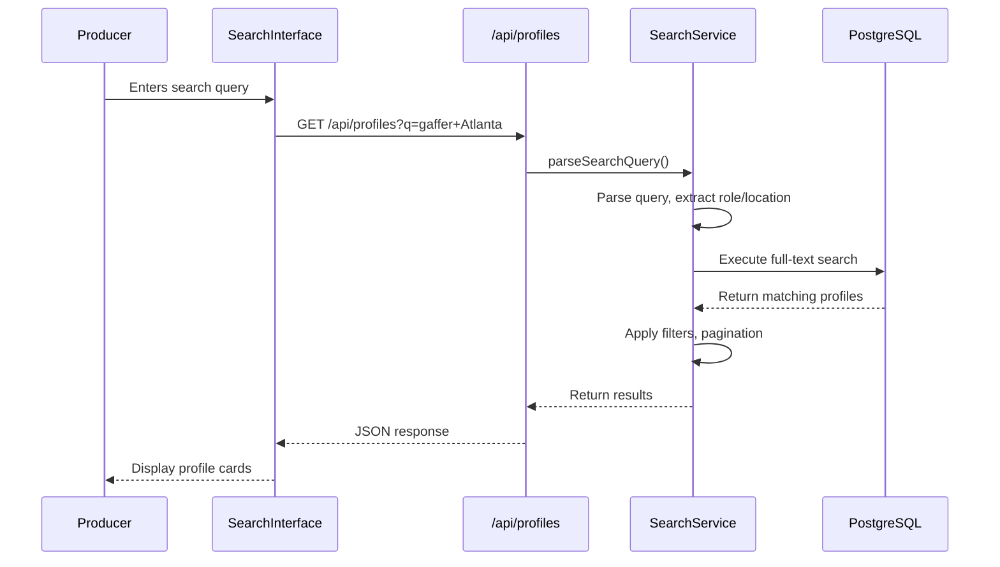
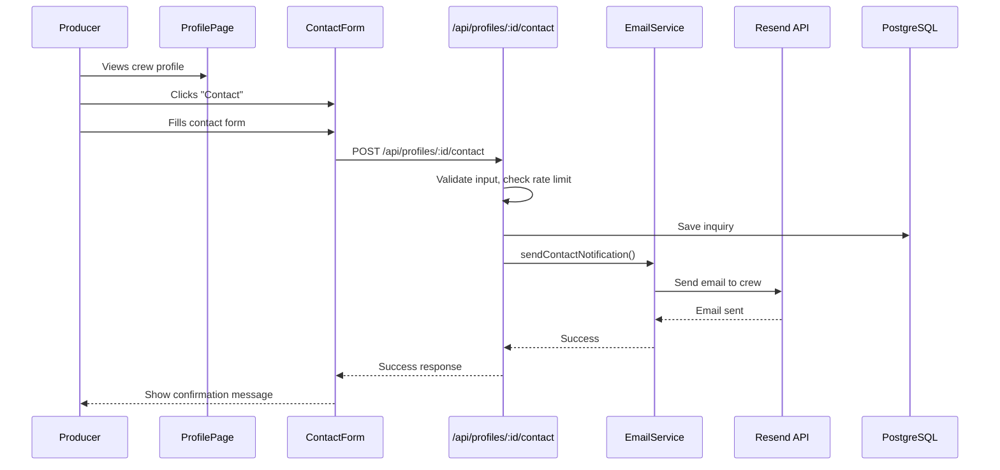
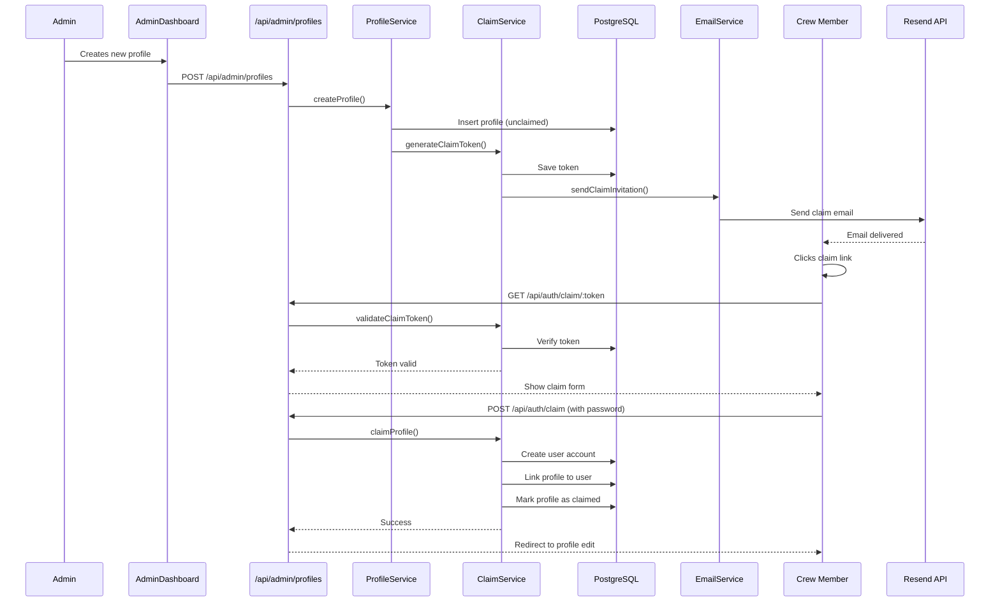

# Core Workflows

## Workflow 1: Producer Searches for Crew

```mermaid
sequenceDiagram
    participant P as Producer
    participant UI as SearchInterface
    participant API as /api/profiles
    participant Search as SearchService
    participant DB as PostgreSQL
    
    P->>UI: Enters search query
    UI->>API: GET /api/profiles?q=gaffer+Atlanta
    API->>Search: parseSearchQuery()
    Search->>Search: Parse query, extract role/location
    Search->>DB: Execute full-text search
    DB-->>Search: Return matching profiles
    Search->>Search: Apply filters, pagination
    Search-->>API: Return results
    API-->>UI: JSON response
    UI-->>P: Display profile cards
```

## Workflow 2: Producer Contacts Crew Member

```mermaid
sequenceDiagram
    participant P as Producer
    participant PF as ProfilePage
    participant CF as ContactForm
    participant API as /api/profiles/:id/contact
    participant Email as EmailService
    participant Resend as Resend API
    participant DB as PostgreSQL
    
    P->>PF: Views crew profile
    P->>CF: Clicks "Contact"
    P->>CF: Fills contact form
    CF->>API: POST /api/profiles/:id/contact
    API->>API: Validate input, check rate limit
    API->>DB: Save inquiry
    API->>Email: sendContactNotification()
    Email->>Resend: Send email to crew
    Resend-->>Email: Email sent
    Email-->>API: Success
    API-->>CF: Success response
    CF-->>P: Show confirmation message
```

## Workflow 3: Admin Creates Profile & Crew Claims It

```mermaid
sequenceDiagram
    participant A as Admin
    participant AD as AdminDashboard
    participant API as /api/admin/profiles
    participant PS as ProfileService
    participant CS as ClaimService
    participant DB as PostgreSQL
    participant Email as EmailService
    participant C as Crew Member
    participant Resend as Resend API
    
    A->>AD: Creates new profile
    AD->>API: POST /api/admin/profiles
    API->>PS: createProfile()
    PS->>DB: Insert profile (unclaimed)
    PS->>CS: generateClaimToken()
    CS->>DB: Save token
    CS->>Email: sendClaimInvitation()
    Email->>Resend: Send claim email
    Resend-->>C: Email delivered
    C->>C: Clicks claim link
    C->>API: GET /api/auth/claim/:token
    API->>CS: validateClaimToken()
    CS->>DB: Verify token
    CS-->>API: Token valid
    API-->>C: Show claim form
    C->>API: POST /api/auth/claim (with password)
    API->>CS: claimProfile()
    CS->>DB: Create user account
    CS->>DB: Link profile to user
    CS->>DB: Mark profile as claimed
    CS-->>API: Success
    API-->>C: Redirect to profile edit
```

