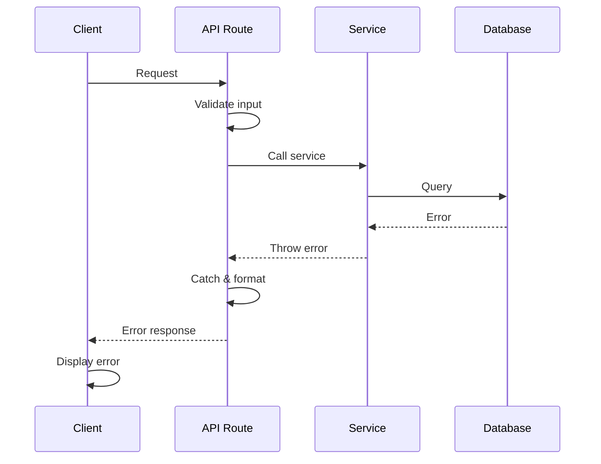

# Error Handling Strategy


## Error Flow



## Error Response Format

```typescript
interface ApiError {
  error: {
    code: string;
    message: string;
    details?: Record<string, any>;
    timestamp: string;
    requestId: string;
  };
}
```

## Frontend Error Handling

```typescript
// lib/hooks/useApi.ts
import { useState } from 'react';
import { ApiError } from '@/lib/services/apiClient';

export function useApi<T>() {
  const [error, setError] = useState<ApiError | null>(null);
  const [isLoading, setIsLoading] = useState(false);
  
  const execute = async (fn: () => Promise<T>): Promise<T | null> => {
    try {
      setIsLoading(true);
      setError(null);
      return await fn();
    } catch (err) {
      if (err instanceof ApiError) {
        setError(err);
      } else {
        setError({
          error: {
            code: 'UNKNOWN_ERROR',
            message: 'An unexpected error occurred',
            timestamp: new Date().toISOString(),
            requestId: '',
          },
        });
      }
      return null;
    } finally {
      setIsLoading(false);
    }
  };
  
  return { execute, error, isLoading };
}
```

## Backend Error Handling

```typescript
// lib/utils/errorHandler.ts
import { NextResponse } from 'next/server';
import { ZodError } from 'zod';

export function handleError(error: unknown): NextResponse {
  if (error instanceof ZodError) {
    return NextResponse.json(
      {
        error: {
          code: 'VALIDATION_ERROR',
          message: 'Invalid request parameters',
          details: error.errors,
          timestamp: new Date().toISOString(),
          requestId: crypto.randomUUID(),
        },
      },
      { status: 400 }
    );
  }
  
  if (error instanceof Error) {
    return NextResponse.json(
      {
        error: {
          code: 'INTERNAL_ERROR',
          message: process.env.NODE_ENV === 'production' 
            ? 'Internal server error' 
            : error.message,
          timestamp: new Date().toISOString(),
          requestId: crypto.randomUUID(),
        },
      },
      { status: 500 }
    );
  }
  
  return NextResponse.json(
    {
      error: {
        code: 'UNKNOWN_ERROR',
        message: 'An unexpected error occurred',
        timestamp: new Date().toISOString(),
        requestId: crypto.randomUUID(),
      },
    },
    { status: 500 }
  );
}
```

