# High Level Architecture


## Technical Summary

Crew Up is built as a modern Jamstack application using Next.js 14+ with the App Router for server-side rendering (SSR), which is critical for SEO optimization. The architecture follows a monolithic fullstack approach where the Next.js application handles both frontend rendering and API routes, eliminating the need for a separate backend service. The platform leverages PostgreSQL via Supabase for data persistence, providing both the database and file storage capabilities. The entire application is deployed on Vercel, which offers seamless Next.js integration, edge functions, and automatic scaling. This architecture achieves the PRD's core goals by enabling fast, SEO-optimized crew profile pages that will rank highly in search results, while maintaining a simple, cost-effective infrastructure that can scale as the user base grows.

## Platform and Infrastructure Choice

**Platform:** Vercel + Supabase

**Rationale:**

After evaluating the PRD requirements, three platform options were considered:

1. **Vercel + Supabase** (Recommended)
   - **Pros:**
     - Native Next.js optimization and deployment
     - Built-in edge network for global performance
     - Supabase provides PostgreSQL, authentication, and storage in one platform
     - Zero-config deployments and automatic scaling
     - Cost-effective for MVP (generous free tier)
     - Excellent developer experience
   - **Cons:**
     - Vendor lock-in to Vercel ecosystem
     - Supabase has some limitations at very large scale

2. **AWS Full Stack (Lambda + RDS + S3)**
   - **Pros:**
     - Maximum flexibility and control
     - Enterprise-grade scalability
     - No vendor lock-in
   - **Cons:**
     - More complex setup and configuration
     - Higher operational overhead
     - More expensive for MVP stage
     - Requires more DevOps expertise

3. **Railway/Render + Supabase**
   - **Pros:**
     - Simple deployment
     - Good for small to medium scale
   - **Cons:**
     - Less optimized for Next.js than Vercel
     - Fewer edge locations
     - Less mature platform

**Selected Platform:** Vercel + Supabase

**Key Services:**
- **Vercel:** Frontend hosting, API routes, edge functions, CDN
- **Supabase:** PostgreSQL database, file storage (profile photos), authentication (for crew/admin accounts)
- **Resend:** Transactional email service (claim invitations, contact form notifications)
- **Vercel Analytics:** Performance and user analytics

**Deployment Host and Regions:**
- Primary: Vercel (Global Edge Network)
- Database: Supabase (US East region for primary, with read replicas available)
- Target: Global deployment with edge caching for optimal SEO performance

## Repository Structure

**Structure:** Monorepo (npm workspaces)

**Monorepo Tool:** npm workspaces (simple, no additional tooling needed for MVP)

**Package Organization:**
```
crew-up/
├── apps/
│   └── web/                    # Next.js application
├── packages/
│   ├── shared/                 # Shared TypeScript types and utilities
│   └── ui/                     # Shared UI components (future)
├── docs/                       # Documentation
└── package.json                # Root workspace config
```

**Rationale:**
- Monorepo enables code sharing between frontend and backend (Next.js API routes)
- Shared types package ensures type safety across the stack
- Simple npm workspaces sufficient for MVP scale
- Can migrate to Turborepo later if build performance becomes an issue
- Keeps structure simple while allowing future expansion

## High Level Architecture Diagram

```mermaid
graph TB
    User[User/Producer] -->|HTTPS| CDN[Vercel Edge CDN]
    CDN -->|SSR/Static| NextApp[Next.js App Router]
    
    NextApp -->|API Calls| APIRoutes[Next.js API Routes]
    APIRoutes -->|Query| Supabase[Supabase PostgreSQL]
    APIRoutes -->|Storage| SupabaseStorage[Supabase Storage]
    APIRoutes -->|Email| Resend[Resend Email Service]
    
    NextApp -->|SEO| Google[Google Search]
    Google -->|Crawls| NextApp
    
    Admin[Admin User] -->|Auth| SupabaseAuth[Supabase Auth]
    Crew[Crew Member] -->|Auth| SupabaseAuth
    SupabaseAuth -->|Session| NextApp
    
    style NextApp fill:#0070f3
    style Supabase fill:#3ecf8e
    style CDN fill:#000000
```



## Architectural Patterns

- **Jamstack Architecture:** Static site generation with serverless API routes - _Rationale:_ Optimal performance and SEO for content-heavy crew profile pages, enables fast page loads critical for search rankings

- **Server-Side Rendering (SSR):** All crew profile pages rendered server-side - _Rationale:_ Essential for SEO as search engines need fully rendered HTML with metadata and schema markup

- **Component-Based UI:** React components with TypeScript - _Rationale:_ Maintainability, type safety, and reusability across the application

- **Repository Pattern:** Abstract data access logic in API routes - _Rationale:_ Enables testing, future database migration flexibility, and clean separation of concerns

- **Progressive Enhancement:** Core functionality works without JavaScript - _Rationale:_ Better SEO, accessibility, and performance for users with slower connections

- **API-First Design:** Next.js API routes as backend endpoints - _Rationale:_ Clean separation, testability, and future flexibility to extract to separate service if needed

